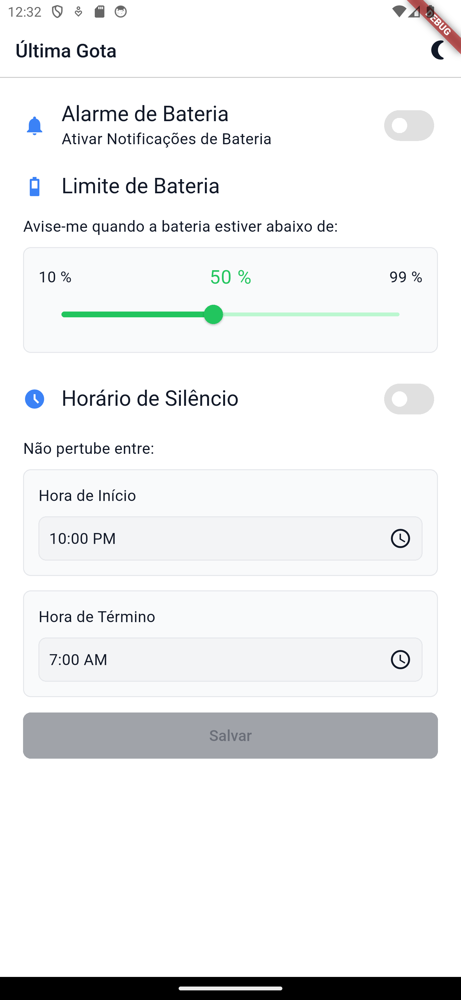

# 🔋 Última Gota

Aplicativo Flutter para Android que monitora o nível da bateria do dispositivo e envia alertas quando a carga atinge níveis críticos — com suporte a horários de silêncio para evitar notificações durante a noite.

---

## Visão Geral

**Última Gota** é uma aplicação simples e desenvolvida com Flutter. O objetivo é permitir que o usuário configure alertas de bateria de forma personalizada, incluindo:

- Alarme com percentual mínimo de bateria
- Horários de silêncio (ex: durante a madrugada)
- Interface intuitiva em uma única tela
- Suporte a tema claro e escuro

---

## Funcionalidades

- Alerta de bateria abaixo de um limite configurável
- Interruptor para ativar/desativar o alarme
- Seleção de faixa horária para silenciar os alertas
- Temas claro/escuro com alternância dinâmica
- Interface limpa

---

## Captura de Tela

| A Única Tela que você precisa               |
|---------------------------------------------|
|  |

---

## Como Rodar o Projeto

### Pré-requisitos

- Flutter ≥ 3.x
- Android SDK
- [FVM](https://fvm.app) (opcional, mas recomendado para controle de versões)

### Passos

```bash
git clone https://github.com/seu-usuario/ultima-gota.git
cd ultima-gota
flutter pub get
flutter run
```

---

## Contribuindo

Contribuições são muito bem-vindas! Sinta-se à vontade para abrir **Issues**, sugerir melhorias ou enviar um **Pull Request**.

---

## Licença

Este projeto está licenciado sob a **[MIT License](LICENSE)** — sinta-se livre para usá-lo e modificá-lo.

---

## Informações adicionais

- **Email para contato:** [alessandro_SSantana@outlook.com]
- **Versão atual:** `v--.--.--`

---

> “Que nunca te falte bateria no momento mais crítico.”
